# Cat Adoption Web Platform — Bachelor’s Thesis Project

## Overview

This project represents a **web application developed as part of my Bachelor's Thesis at Babeș-Bolyai University (FSEGA)**.  
The platform was created to **simplify and encourage cat adoption in Romania**, offering a modern, interactive space where animal lovers can discover available cats, submit adoption requests, schedule visits, and share their own adoption stories.

The application integrates several essential modules such as **real-time notifications**, **online donations**, and an **AI component** capable of recognizing a cat’s breed from an uploaded image.  
All activities are managed through a **dedicated admin panel**, providing full control over users, adoption requests, donations, and system statistics.

The idea originated from my passion for cats and the desire to **improve and digitalize the adoption process**, making it more transparent and accessible.  
The goal was to design a platform that benefits both users looking to adopt and shelters managing the adoption workflow efficiently.

This project was built using **Laravel (PHP framework)**.

You can **explore the live website** here:  
🔗 [https://malina.ro/](https://malina.ro/)

The **source code** is available in the `bdproject` folder,  
and the **complete documentation** including system design, implementation details, and testing can be found in the `documentation` folder.

---
## Technologies Used

The application was built using a modern and scalable web stack that ensures both performance and flexibility.  
The main technologies and tools used include:

- **Laravel (PHP Framework)**  
- **MySQL**  
- **HTML5, CSS3, JavaScript**  
- **Bootstrap 5**  
- **Vue.js**

Additional integrations and libraries:
- **FullCalendar.js**  
- **SweetAlert** and **Toastr.js**  
- **Stripe.js**  
- **Pusher.js**  
- **TensorFlow.js**

---

## Application Features

The Cat Adoption Web Platform integrates several essential modules that make the adoption process easy, transparent, and interactive.  
Below are the main functionalities and their corresponding interface screenshots.

### 1. Home Page  
The home page welcomes users with a clean and friendly design.  
It provides quick navigation to available cats, user accounts, notifications, and the favorites list.  
Interactive cards guide visitors toward the main sections of the platform.

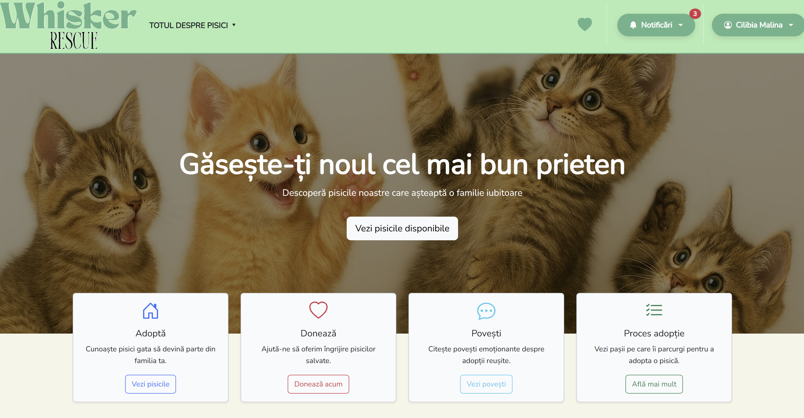

### 2. Adoption Form  
The adoption form allows users to fill out all required details for adopting a cat.  
Each field includes validation rules, and users receive instant feedback for incorrect or missing inputs.  
After submission, the form data is processed and stored securely in the database.

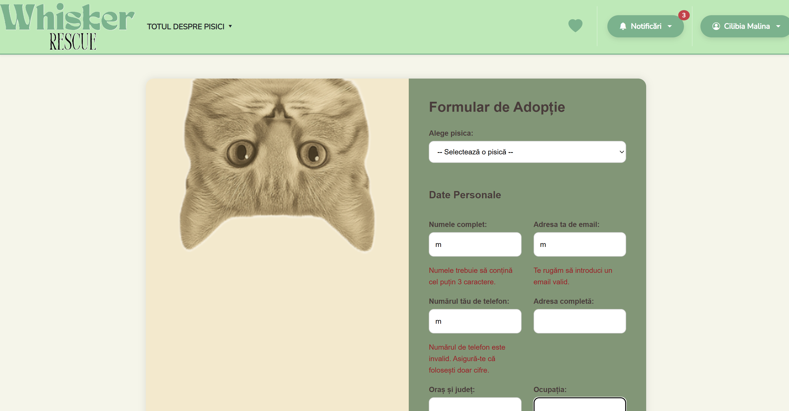

### 3. Appointment Scheduling  
Users can schedule their adoption visits directly through an interactive calendar built with **FullCalendar.js**.  
Unavailable days (weekends and past dates) are automatically disabled, and users can select only valid dates and times.

### 4. My Requests  
In this section, users can view all their submitted adoption requests, including details and current status.  
They can track approvals, see rejection reasons if applicable, and stay updated about their progress.

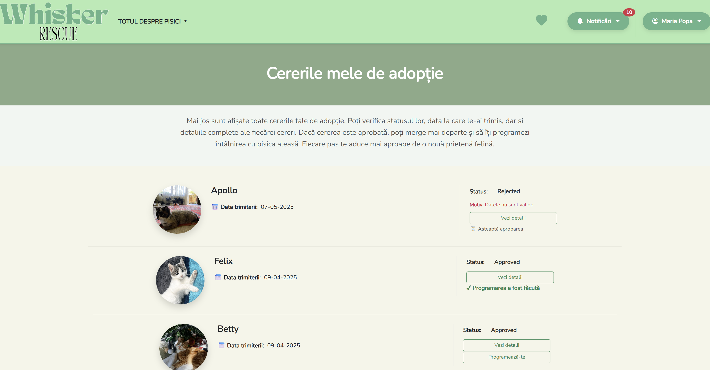

### 5. Donations  
The donation system enables secure payments via **Stripe**, supporting shelter operations.  
Users can donate preset or custom amounts, and successful donations trigger confirmation emails.  
A progress bar displays how close the shelter is to reaching its financial goal.

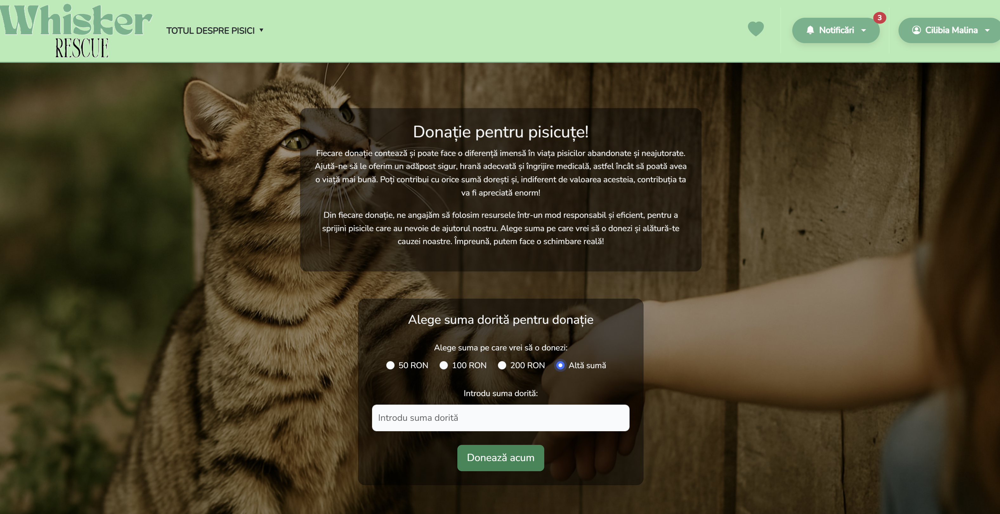

### 6. Adoption Stories  
Users can share personal adoption experiences and view stories from other adopters.  
Each story is reviewed by administrators before being published, building community trust and inspiration.

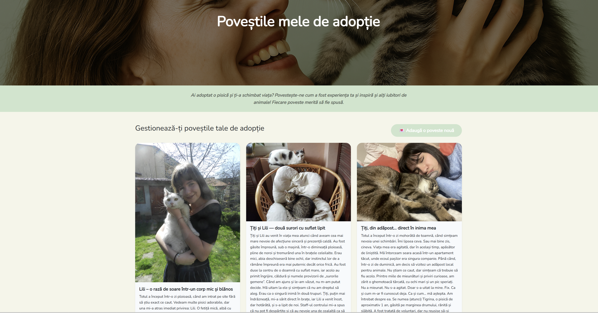

### 7. Notifications  
The platform includes **real-time notifications** powered by **Pusher** and **Toastr.js**.  
Users are instantly informed about adoption approvals, appointment updates, and reminders.  
Notifications can be viewed directly in pop-up form or from the dedicated dropdown menu.

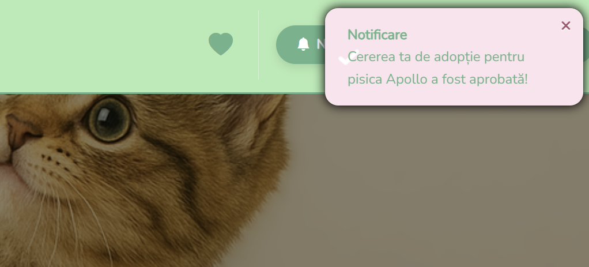  
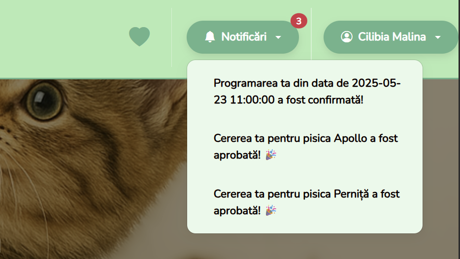

### 8. Admin Dashboard  
Administrators have access to a complete dashboard where they can monitor activity, manage users, and analyze statistics.  
Interactive graphs (built with **Chart.js**) display monthly adoption and appointment data for better insights.

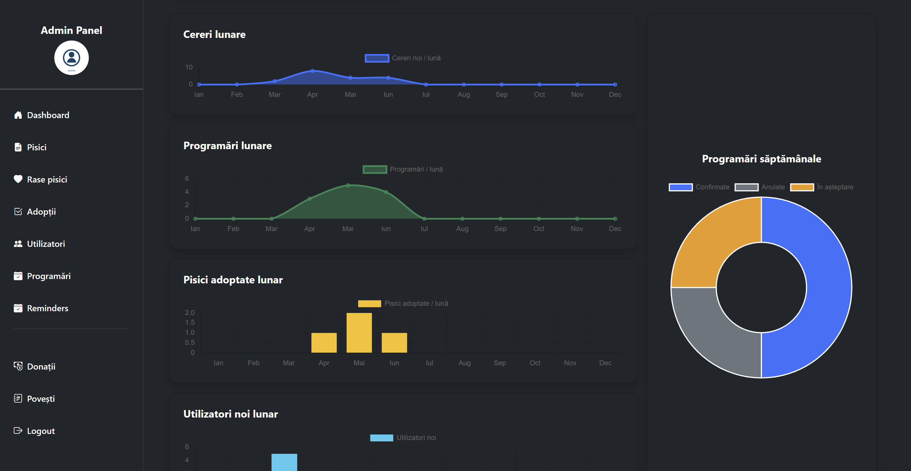

### 9. Adoption Requests Management (Admin)  
From this section, administrators can view, approve, or reject user adoption requests.  
Each decision automatically triggers a personalized notification and updates the request’s status in real time.

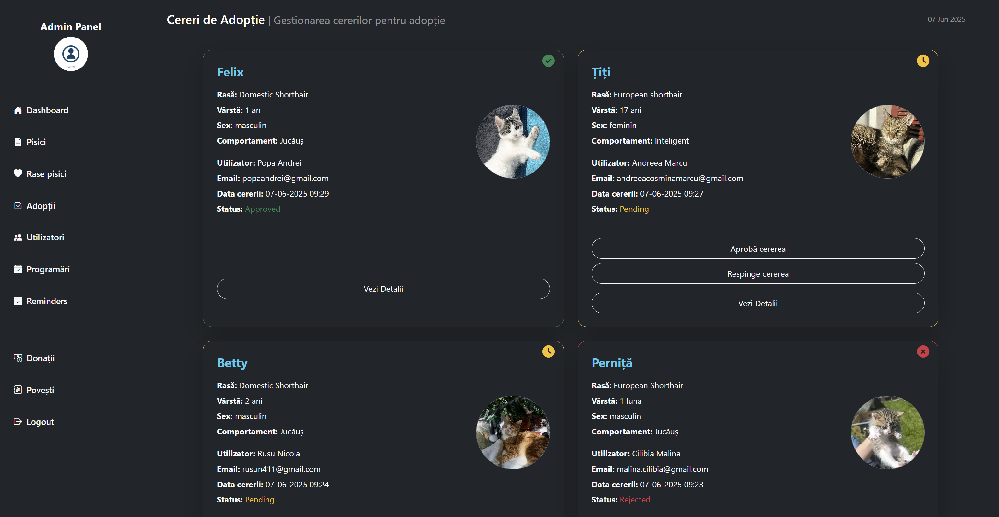

### 10. Appointment Management (Admin)  
Administrators can manage appointments efficiently approving, canceling, or marking them as completed.  
After successful adoptions, the system automatically sends users a PDF adoption certificate by email.

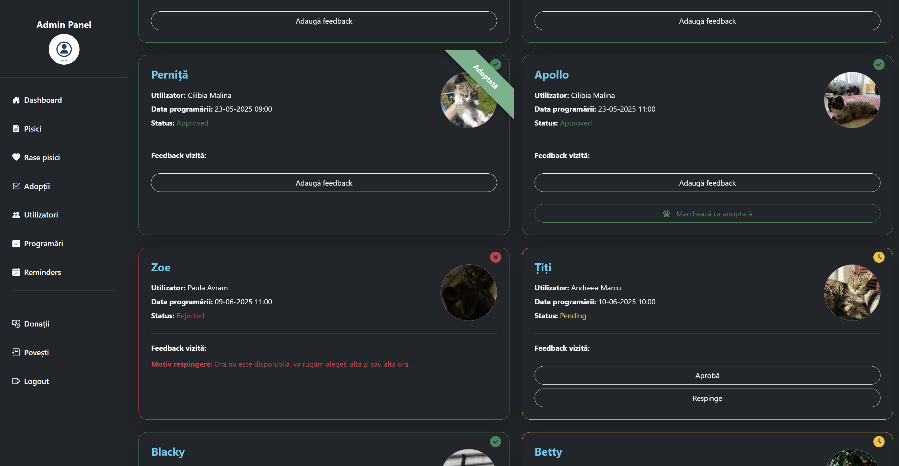

---

## AI Integration — Cat Breed Recognition

One of the most innovative parts of this project is the integration of **artificial intelligence** for cat breed recognition.  
This feature allows administrators to upload a photo of a cat, and the system automatically identifies its breed in real time.  
It simplifies the process of adding new cats for adoption, especially when the breed is not known.

The AI model was trained in **Google Colab** using the **Oxford-IIIT Pet Dataset** (37 classes of cats and dogs, with over 7,000 images).  
Data preprocessing was handled through a custom Keras generator that resized, normalized, and encoded images for classification.

For training, the **MobileNetV2** architecture was used with fine-tuning, achieving a final accuracy of **97.8%** on the validation set after 30 epochs.  
The model was then converted to **TensorFlow.js** format to run directly in the browser for instant predictions, without requiring server processing.

In the admin panel, users can drag and drop an image, and the AI instantly predicts the cat’s breed — for example, “Siamese.”  
This functionality was implemented using the `@tensorflow/tfjs` library, which loads and executes the trained model in real time.

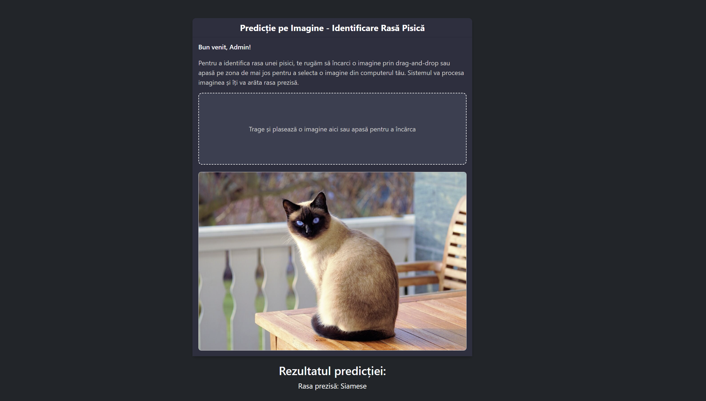

